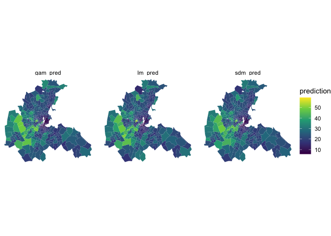

Spatial regression demos
================
Chris Hess
5/4/2021

``` r
#dependencies
library(tidyverse)
library(sf)
library(spatialreg)
library(spdep)
library(INLA)

#load the Boston housing Ddata
boston <- read_sf(system.file("shapes/boston_tracts.shp", package = "spData")) %>%
  st_transform(crs = 5070) #epsg for USA Contiguous Albers Equal Area Conic, USGS
```

<br>

## Overview

This vignette is focused on demonstrating code for setting up and
estimating spatial regression models in R. The models are focused on the
effect of air quality on home values, with the precise specifications
drawn from Harris & Rubenfield 1978’s original use of the Boston data
and a more recent paper (Bivand 2017) that revisits the topic with
models estimated in R.

Check out these papers if interested the nuts and bolts of how the
covariate specifications but this should not be material to
understanding the setup for these models in R.

<br>

## Boston housing data

For detailed information, check out the `boston` data’s R documentation
page. This is a set of built-in data that come with the `spData` library
that can be loaded like we have above or that can be downloaded from
many sources as standalone files (GeoDa’s data center, Kaggle, etc.)

``` r
?boston
```

Here’s a quick look at the data for right now though:

``` r
glimpse(boston)
```

    ## Rows: 506
    ## Columns: 37
    ## $ poltract <chr> "0001", "0002", "0003", "0004", "0005", "0006", "0007", "0008…
    ## $ TOWN     <chr> "Boston Allston-Brighton", "Boston Allston-Brighton", "Boston…
    ## $ TOWNNO   <dbl> 74, 74, 74, 74, 74, 74, 74, 74, 75, 75, 75, 75, 75, 75, 76, 7…
    ## $ TRACT    <dbl> 1, 2, 3, 4, 5, 6, 7, 8, 101, 102, 104, 105, 107, 108, 201, 20…
    ## $ LON      <dbl> -71.0830, -71.0950, -71.1007, -71.0930, -71.0905, -71.0865, -…
    ## $ LAT      <dbl> 42.2172, 42.2120, 42.2100, 42.2070, 42.2033, 42.2100, 42.2080…
    ## $ MEDV     <dbl> 17.8, 21.7, 22.7, 22.6, 25.0, 19.9, 20.8, 16.8, 21.9, 27.5, 2…
    ## $ CMEDV    <dbl> 17.8, 21.7, 22.7, 22.6, 25.0, 19.9, 20.8, 16.8, 21.9, 27.5, 2…
    ## $ CRIM     <dbl> 8.98296, 3.84970, 5.20177, 4.26131, 4.54192, 3.83684, 3.67822…
    ## $ ZN       <dbl> 0, 0, 0, 0, 0, 0, 0, 0, 0, 0, 0, 0, 0, 0, 0, 0, 0, 0, 0, 0, 0…
    ## $ INDUS    <dbl> 18.1, 18.1, 18.1, 18.1, 18.1, 18.1, 18.1, 18.1, 18.1, 18.1, 1…
    ## $ CHAS     <chr> "1", "1", "1", "0", "0", "0", "0", "1", "1", "0", "0", "0", "…
    ## $ NOX      <dbl> 0.770, 0.770, 0.770, 0.770, 0.770, 0.770, 0.770, 0.770, 0.718…
    ## $ RM       <dbl> 6.212, 6.395, 6.127, 6.112, 6.398, 6.251, 5.362, 5.803, 8.780…
    ## $ AGE      <dbl> 97.4, 91.0, 83.4, 81.3, 88.0, 91.1, 96.2, 89.0, 82.9, 87.9, 9…
    ## $ DIS      <dbl> 2.1222, 2.5052, 2.7227, 2.5091, 2.5182, 2.2955, 2.1036, 1.904…
    ## $ RAD      <dbl> 24, 24, 24, 24, 24, 24, 24, 24, 24, 24, 24, 24, 24, 24, 24, 2…
    ## $ TAX      <dbl> 666, 666, 666, 666, 666, 666, 666, 666, 666, 666, 666, 666, 6…
    ## $ PTRATIO  <dbl> 20.2, 20.2, 20.2, 20.2, 20.2, 20.2, 20.2, 20.2, 20.2, 20.2, 2…
    ## $ B        <dbl> 377.73, 391.34, 395.43, 390.74, 374.56, 350.65, 380.79, 353.0…
    ## $ LSTAT    <dbl> 17.60, 13.27, 11.48, 12.67, 7.79, 14.19, 10.19, 14.64, 5.29, …
    ## $ units    <int> 126, 399, 368, 220, 44, 221, 39, 203, 33, 5, 21, 15, 27, 50, …
    ## $ cu5k     <int> 3, 4, 3, 3, 0, 2, 0, 2, 0, 0, 1, 0, 0, 0, 0, 1, 0, 0, 0, 7, 1…
    ## $ c5_7_5   <int> 3, 10, 1, 2, 0, 3, 0, 6, 0, 0, 2, 0, 0, 0, 0, 0, 0, 2, 0, 7, …
    ## $ C7_5_10  <int> 4, 7, 2, 2, 1, 7, 0, 14, 4, 0, 1, 0, 0, 0, 0, 2, 1, 2, 2, 16,…
    ## $ C10_15   <int> 26, 37, 25, 23, 1, 31, 4, 45, 5, 1, 1, 2, 0, 0, 1, 2, 0, 1, 1…
    ## $ C15_20   <int> 43, 95, 84, 45, 11, 69, 14, 73, 6, 0, 4, 3, 0, 2, 0, 1, 0, 2,…
    ## $ C20_25   <int> 29, 139, 127, 67, 9, 72, 9, 41, 4, 1, 4, 4, 2, 4, 3, 5, 0, 1,…
    ## $ C25_35   <int> 16, 93, 102, 63, 12, 30, 11, 17, 5, 2, 6, 2, 3, 1, 8, 9, 3, 1…
    ## $ C35_50   <int> 1, 9, 24, 12, 9, 6, 0, 5, 4, 1, 2, 4, 2, 10, 14, 11, 1, 0, 0,…
    ## $ co50k    <int> 1, 5, 0, 3, 1, 1, 1, 0, 5, 0, 0, 0, 20, 33, 185, 31, 6, 0, 0,…
    ## $ median   <int> 17800, 21700, 22700, 22600, 25000, 19900, 20800, 16800, 21900…
    ## $ BB       <dbl> 0.8, 1.4, 0.3, 0.8, 1.8, 3.7, 1.2, 3.6, 3.5, 3.4, 6.8, 26.7, …
    ## $ censored <chr> "no", "no", "no", "no", "no", "no", "no", "no", "no", "no", "…
    ## $ NOX_ID   <int> 1, 1, 1, 1, 1, 1, 1, 1, 2, 2, 2, 3, 3, 3, 3, 3, 4, 4, 4, 5, 5…
    ## $ POP      <int> 3962, 9245, 6842, 8342, 7836, 9276, 9730, 8441, 10244, 7812, …
    ## $ geometry <POLYGON [m]> POLYGON ((2012547 2417092, ..., POLYGON ((2010448 241…

<br>

### Spatial extent

We map the `boston` data’s corrected median home value (`CMEDV`) here
for reference.

``` r
#CMEDV - corrected median values of owner-occupied housing in USD 1000
ggplot(boston, aes(fill = CMEDV)) +
  geom_sf(color = NA) +
  labs(fill = "Median owner-occupied housing value") +
  scale_fill_viridis_b() +
  theme(legend.position = "bottom")
```

<!-- -->

<br>

## Getting things ready

<br>

#### Polygon -\> Neighborhood list

Contiguity based neighbors are probably the most common type of neighbor
lists used for spatial regressions. Here we show how to use function
`poly2nb()` to use a spatial object to a create neighborhood list.

`knearneigh` and `knn2nb()` provide an alternative nearest neighbor
approach for generating neighborhood lists for reference.

``` r
#first add a row number that will index neighborhood list entries to relate to df rows
boston <- boston %>% mutate(tract_idx = row_number())

#contiguity neighborhood list can be created with poly2nb (nb: fn wants sp* object not sf)
boston_nb <- poly2nb(as_Spatial(boston), row.names = boston$tract_idx)

#this is a little more useful than the print method for nb objects
summary(boston_nb)
```

    ## Neighbour list object:
    ## Number of regions: 506 
    ## Number of nonzero links: 2910 
    ## Percentage nonzero weights: 1.136559 
    ## Average number of links: 5.750988 
    ## Link number distribution:
    ## 
    ##   1   2   3   4   5   6   7   8   9  10  11  12  15 
    ##   3   9  28  81 107 120  87  40  22   5   2   1   1 
    ## 3 least connected regions:
    ## 18 51 345 with 1 link
    ## 1 most connected region:
    ## 112 with 15 links

<br>

#### Removing empty neighbor sets

NB: regarding zero policy: you technically can set `zero.policy = TRUE`
to ignore empty neighbor sets but these models aren’t really intended to
have isolates / islands. See responses from Roger Bivand (package
author) dug up from the R spatial listserv on this matter:

> The lagged value of a no-neighbour observation is not well defined, as
> setting 0 may be misleading, and setting NA will break the next
> operations, in this case calculating measures based on the weights. If
> you really want regions with no neighbours, you must use zero.policy =
> TRUE everwhere - because usually you are advised not to generate such
> neighbour objects (the theoretical properties of tests etc. were
> developed for graphs with all regions connected.

You can use subset with the cardinality of the neighborhood list to
remove these empty neighbor cases. First remove the corresponding rows
from the data frame that will be used for modeling, then remove the
neighborhood list entries.

There aren’t any islands in these data but the following code is what
would be used in the event that there were.

``` r
boston <- subset(boston, subset = card(boston_nb) > 0)
boston_nb <- subset(boston_nb, subset = card(boston_nb) > 0)
```

<br>

#### Visualizing the neighborhood structure

Sometimes it can be useful to show the neighborhood structure across
spatial units as a way of identifying whether this spatial
pre-processing is producing the desired outcome.

``` r
#we need to translate the nb object into a network of vectors for plotting
boston_neighbors_sf <- st_as_sf(nb2lines(boston_nb, coords = coordinates(as_Spatial(boston)),
                                         proj4string = proj4string(as_Spatial(boston))))

#once we have that, we can assemble a map showing the neighborhood structure
ggplot(boston) + 
  geom_sf(fill = 'grey70', color = 'white') +
  geom_sf(data = boston_neighbors_sf, lwd = .1) +
  geom_sf(data = st_centroid(st_geometry(boston)), size = .75) +
  theme_void()
```

<!-- -->

<br>

#### Neighborhood list -\> spatial weights matrix

The neighborhood list gets us part of the way to where we need to go.
The primary spatial regression functions provided by the `spatialreg`
library all expect a `listw` spatial weights object that is one step
removed from the neighborhood list we’ve already created.

`nb2listw()` handles this task of creating a spatial weights object,
with row-standardized `style = "W"` (default) or `style = "B"` for
binary coding being the most common approaches for constructing spatial
weights.

``` r
#row standardized
boston_listw_w <- nb2listw(boston_nb, style = "W")

#unstandardized
boston_listw_b <- nb2listw(boston_nb, style = "B")
```

<br>

`listw` can be coerced into a sparse matrix that is potentially useful
when the data in question are large and estimation of models is
producing issues NaNs due to a “poorly conditioned” numerical Hessian.

We can visualize the matrix with `image()` to see what it describes,
though this admittedly isn’t super useful. The regression functions
eventually take the `sp_powers_traces` created here as as an additional
parameter.

``` r
#coerce to sparse matrix
boston_csparse_matrix <- as(boston_listw_w, "CsparseMatrix")

#visualize the sparse matrix
image(boston_csparse_matrix)
```

<!-- -->

``` r
#this is what is used within spatial regression functions in large data cases
boston_listw_powers_traces <- trW(boston_csparse_matrix, type = "mult")
```

<br>

## Estimating spatial models

### Linear regression baseline

``` r
#estimate the Harrison and Rubenfield model for housing price ~ air quality 
linear_model <- lm(log(CMEDV) ~ I(NOX^2) + CRIM + ZN + INDUS + CHAS + I(RM^2) +
                    AGE + log(DIS) + log(RAD) + TAX + PTRATIO + B + log(LSTAT), 
                   data = boston)

#look at model coefficients
summary(linear_model)
```

    ## 
    ## Call:
    ## lm(formula = log(CMEDV) ~ I(NOX^2) + CRIM + ZN + INDUS + CHAS + 
    ##     I(RM^2) + AGE + log(DIS) + log(RAD) + TAX + PTRATIO + B + 
    ##     log(LSTAT), data = boston)
    ## 
    ## Residuals:
    ##      Min       1Q   Median       3Q      Max 
    ## -0.70893 -0.09295 -0.01049  0.09575  0.79618 
    ## 
    ## Coefficients:
    ##               Estimate Std. Error t value Pr(>|t|)    
    ## (Intercept)  4.562e+00  1.523e-01  29.955  < 2e-16 ***
    ## I(NOX^2)    -6.372e-01  1.116e-01  -5.711 1.95e-08 ***
    ## CRIM        -1.177e-02  1.228e-03  -9.590  < 2e-16 ***
    ## ZN           9.175e-05  4.987e-04   0.184 0.854085    
    ## INDUS        1.789e-04  2.331e-03   0.077 0.938846    
    ## CHAS1        9.213e-02  3.274e-02   2.813 0.005097 ** 
    ## I(RM^2)      6.255e-03  1.294e-03   4.833 1.80e-06 ***
    ## AGE          7.100e-05  5.190e-04   0.137 0.891253    
    ## log(DIS)    -1.978e-01  3.293e-02  -6.007 3.67e-09 ***
    ## log(RAD)     8.957e-02  1.887e-02   4.746 2.72e-06 ***
    ## TAX         -4.191e-04  1.210e-04  -3.464 0.000579 ***
    ## PTRATIO     -2.960e-02  4.944e-03  -5.986 4.14e-09 ***
    ## B            3.611e-04  1.017e-04   3.551 0.000421 ***
    ## log(LSTAT)  -3.749e-01  2.466e-02 -15.200  < 2e-16 ***
    ## ---
    ## Signif. codes:  0 '***' 0.001 '**' 0.01 '*' 0.05 '.' 0.1 ' ' 1
    ## 
    ## Residual standard error: 0.1799 on 492 degrees of freedom
    ## Multiple R-squared:  0.8108, Adjusted R-squared:  0.8058 
    ## F-statistic: 162.1 on 13 and 492 DF,  p-value: < 2.2e-16

``` r
#add column of fitted values to boston sf object
boston$lm_pred <- predict(linear_model)
```

<br>

### Residual spatial autocorrelation

#### Map the residual spatial autocorrelation

``` r
#choropleth map to investigate spatial structure in residuals
ggplot(boston, aes(fill = log(CMEDV) - lm_pred)) +
  geom_sf(color = NA) +
  scale_fill_gradient2()
```

<!-- -->

``` r
#aspatial plots for residual analysis
#plot(linear_model)
```

<br>

#### Moran’s I test for residual spatial autocorrelation

``` r
#test for residual spatial autocorrelation with Moran's I
lm.morantest(linear_model, boston_listw_w)
```

    ## 
    ##  Global Moran I for regression residuals
    ## 
    ## data:  
    ## model: lm(formula = log(CMEDV) ~ I(NOX^2) + CRIM + ZN + INDUS + CHAS +
    ## I(RM^2) + AGE + log(DIS) + log(RAD) + TAX + PTRATIO + B + log(LSTAT),
    ## data = boston)
    ## weights: boston_listw_w
    ## 
    ## Moran I statistic standard deviate = 16.105, p-value < 2.2e-16
    ## alternative hypothesis: greater
    ## sample estimates:
    ## Observed Moran I      Expectation         Variance 
    ##     0.4066824139    -0.0162985849     0.0006897623

<br>

#### Lagrage multiplier diagnostics for spatial dependence

``` r
lm.LMtests(linear_model, boston_listw_w, test = "all")
```

    ## 
    ##  Lagrange multiplier diagnostics for spatial dependence
    ## 
    ## data:  
    ## model: lm(formula = log(CMEDV) ~ I(NOX^2) + CRIM + ZN + INDUS + CHAS +
    ## I(RM^2) + AGE + log(DIS) + log(RAD) + TAX + PTRATIO + B + log(LSTAT),
    ## data = boston)
    ## weights: boston_listw_w
    ## 
    ## LMerr = 224.94, df = 1, p-value < 2.2e-16
    ## 
    ## 
    ##  Lagrange multiplier diagnostics for spatial dependence
    ## 
    ## data:  
    ## model: lm(formula = log(CMEDV) ~ I(NOX^2) + CRIM + ZN + INDUS + CHAS +
    ## I(RM^2) + AGE + log(DIS) + log(RAD) + TAX + PTRATIO + B + log(LSTAT),
    ## data = boston)
    ## weights: boston_listw_w
    ## 
    ## LMlag = 222.6, df = 1, p-value < 2.2e-16
    ## 
    ## 
    ##  Lagrange multiplier diagnostics for spatial dependence
    ## 
    ## data:  
    ## model: lm(formula = log(CMEDV) ~ I(NOX^2) + CRIM + ZN + INDUS + CHAS +
    ## I(RM^2) + AGE + log(DIS) + log(RAD) + TAX + PTRATIO + B + log(LSTAT),
    ## data = boston)
    ## weights: boston_listw_w
    ## 
    ## RLMerr = 57.337, df = 1, p-value = 3.675e-14
    ## 
    ## 
    ##  Lagrange multiplier diagnostics for spatial dependence
    ## 
    ## data:  
    ## model: lm(formula = log(CMEDV) ~ I(NOX^2) + CRIM + ZN + INDUS + CHAS +
    ## I(RM^2) + AGE + log(DIS) + log(RAD) + TAX + PTRATIO + B + log(LSTAT),
    ## data = boston)
    ## weights: boston_listw_w
    ## 
    ## RLMlag = 54.993, df = 1, p-value = 1.21e-13
    ## 
    ## 
    ##  Lagrange multiplier diagnostics for spatial dependence
    ## 
    ## data:  
    ## model: lm(formula = log(CMEDV) ~ I(NOX^2) + CRIM + ZN + INDUS + CHAS +
    ## I(RM^2) + AGE + log(DIS) + log(RAD) + TAX + PTRATIO + B + log(LSTAT),
    ## data = boston)
    ## weights: boston_listw_w
    ## 
    ## SARMA = 279.93, df = 2, p-value < 2.2e-16

<br>

### Spatial models

Simultaneous autoregressive models are typically estimated with maximum
likelihood and most commonly found in papers from economics, sociology
and other social sciences where inference on a particular association is
the primary objective.

There are also full Bayesian methods for SAR models in various
frameworks like stan and INLA.

<br>

#### Three spatial extensions from OLS

1.  Endogenous interaction
2.  Exogenous interaction effects
3.  Spatially structured error terms

Any combination of these can be incorporated under what is called the
General Nesting Spatial Model, but it is useful to go through each
individually first.

<br>

#### Spatial lag model (SLM)

Spatial lag models are used to capture when a dependent variable y in
place i is affected by the independent variables in both place i and j.

This spatial dependence between units violates the OLS assumption of
independent error terms as well as the assumption of independence of
observations, so resulting estimates are potentially biased and
inefficient.

These models estimate a term \(\rho\) that denotes the spatial
dependence, whether this is positive (reflects diffusion across like
places) or negative (reflects resistance process like places)

``` r
#estimate spatial lag model
spatial_lag_model <- lagsarlm(log(CMEDV) ~ I(NOX^2) + CRIM + ZN + INDUS + CHAS + I(RM^2) +
                                AGE + log(DIS) + log(RAD) + TAX + PTRATIO + B + log(LSTAT),
                              data = boston,
                              listw = boston_listw_w)

#summary of spatial lag model
summary(spatial_lag_model)
```

    ## 
    ## Call:lagsarlm(formula = log(CMEDV) ~ I(NOX^2) + CRIM + ZN + INDUS + 
    ##     CHAS + I(RM^2) + AGE + log(DIS) + log(RAD) + TAX + PTRATIO + 
    ##     B + log(LSTAT), data = boston, listw = boston_listw_w)
    ## 
    ## Residuals:
    ##        Min         1Q     Median         3Q        Max 
    ## -0.5547848 -0.0707328 -0.0021583  0.0742370  0.7791937 
    ## 
    ## Type: lag 
    ## Coefficients: (asymptotic standard errors) 
    ##                Estimate  Std. Error  z value  Pr(>|z|)
    ## (Intercept)  2.2676e+00  1.8275e-01  12.4083 < 2.2e-16
    ## I(NOX^2)    -3.0054e-01  8.9607e-02  -3.3539 0.0007968
    ## CRIM        -7.5636e-03  9.9193e-04  -7.6251 2.442e-14
    ## ZN           4.0275e-04  3.9250e-04   1.0261 0.3048379
    ## INDUS        8.7224e-04  1.8325e-03   0.4760 0.6340890
    ## CHAS1        2.6537e-02  2.6012e-02   1.0202 0.3076385
    ## I(RM^2)      7.2193e-03  1.0199e-03   7.0783 1.459e-12
    ## AGE         -8.9554e-05  4.0832e-04  -0.2193 0.8263978
    ## log(DIS)    -1.6663e-01  2.5990e-02  -6.4114 1.442e-10
    ## log(RAD)     6.2042e-02  1.4941e-02   4.1524 3.290e-05
    ## TAX         -3.2146e-04  9.5588e-05  -3.3630 0.0007710
    ## PTRATIO     -9.4438e-03  4.0794e-03  -2.3150 0.0206138
    ## B            2.3258e-04  8.0951e-05   2.8731 0.0040646
    ## log(LSTAT)  -2.4740e-01  2.0728e-02 -11.9356 < 2.2e-16
    ## 
    ## Rho: 0.48736, LR test value: 204.42, p-value: < 2.22e-16
    ## Asymptotic standard error: 0.031095
    ##     z-value: 15.673, p-value: < 2.22e-16
    ## Wald statistic: 245.65, p-value: < 2.22e-16
    ## 
    ## Log likelihood: 259.1874 for lag model
    ## ML residual variance (sigma squared): 0.020007, (sigma: 0.14145)
    ## Number of observations: 506 
    ## Number of parameters estimated: 16 
    ## AIC: -486.37, (AIC for lm: -283.96)
    ## LM test for residual autocorrelation
    ## test value: 16.384, p-value: 5.1715e-05

``` r
#fitted values from spatial lag model
boston$slm_pred <- predict(spatial_lag_model)

#to pass the vector of powered spatial weights matrix traces output by trW
#according to the docs "when given, insert the asymptotic analytical values 
#into the numerical Hessian instead of the approximated values; may be used to 
#get around some problems raised when the numerical Hessian is poorly conditioned, 
#generating NaNs in subsequent operations;
# lagsarlm(log(CMEDV) ~ I(NOX^2) + CRIM + ZN + INDUS + CHAS + I(RM^2) +
#            AGE + log(DIS) + log(RAD) + TAX + PTRATIO + B + log(LSTAT),
#          data = boston,
#          listw = boston_listw_w,
#          method = "Matrix",
#          trs = boston_listw_powers_traces)
```

<br>

#### Spatial error model (SEM)

Spatial error refers to when the error terms across different spatial
units are correlated and can reflect omitted, spatially-correlated
covariates that would bias inference on a focal term. Spatial error in
linear regression only violates the assumption of uncorrelated error
terms, making estimates inefficient.

The spatial error model (SEM) is thus more of a nuisance correction than
a substantively different model from linear regression like spatial lag
models. That is, the error term is decomposed into a spatially
structured component based on neighbors, and a non-structured component
that captures the rest.

``` r
#estimate spatial error model
spatial_error_model <- errorsarlm(log(CMEDV) ~ I(NOX^2) + CRIM + ZN + INDUS + CHAS + I(RM^2) +
                                    AGE + log(DIS) + log(RAD) + TAX + PTRATIO + B + log(LSTAT),
                                  data = boston,
                                  listw = boston_listw_w)

#summary of spatial error model
summary(spatial_error_model)
```

    ## 
    ## Call:errorsarlm(formula = log(CMEDV) ~ I(NOX^2) + CRIM + ZN + INDUS + 
    ##     CHAS + I(RM^2) + AGE + log(DIS) + log(RAD) + TAX + PTRATIO + 
    ##     B + log(LSTAT), data = boston, listw = boston_listw_w)
    ## 
    ## Residuals:
    ##         Min          1Q      Median          3Q         Max 
    ## -0.61146687 -0.06671285  0.00046003  0.07070515  0.80415279 
    ## 
    ## Type: error 
    ## Coefficients: (asymptotic standard errors) 
    ##                Estimate  Std. Error  z value  Pr(>|z|)
    ## (Intercept)  3.81432215  0.16515253  23.0958 < 2.2e-16
    ## I(NOX^2)    -0.49367466  0.15075454  -3.2747 0.0010578
    ## CRIM        -0.00729759  0.00103046  -7.0819 1.422e-12
    ## ZN           0.00015001  0.00048862   0.3070 0.7588464
    ## INDUS        0.00077051  0.00261765   0.2944 0.7684879
    ## CHAS1       -0.00997975  0.03456581  -0.2887 0.7727977
    ## I(RM^2)      0.00981723  0.00112116   8.7563 < 2.2e-16
    ## AGE         -0.00085808  0.00050532  -1.6981 0.0894894
    ## log(DIS)    -0.12992281  0.04991622  -2.6028 0.0092461
    ## log(RAD)     0.06521841  0.02032998   3.2080 0.0013367
    ## TAX         -0.00040082  0.00012115  -3.3085 0.0009378
    ## PTRATIO     -0.01645701  0.00562661  -2.9249 0.0034462
    ## B            0.00046725  0.00011878   3.9336 8.367e-05
    ## log(LSTAT)  -0.26002115  0.02293260 -11.3385 < 2.2e-16
    ## 
    ## Lambda: 0.74789, LR test value: 210.72, p-value: < 2.22e-16
    ## Asymptotic standard error: 0.035346
    ##     z-value: 21.159, p-value: < 2.22e-16
    ## Wald statistic: 447.71, p-value: < 2.22e-16
    ## 
    ## Log likelihood: 262.3411 for error model
    ## ML residual variance (sigma squared): 0.018077, (sigma: 0.13445)
    ## Number of observations: 506 
    ## Number of parameters estimated: 16 
    ## AIC: -492.68, (AIC for lm: -283.96)

``` r
#fitted values from spatial error model
boston$sem_pred <- predict(spatial_error_model)
```

<br>

#### Spatial Durbin model (SDM)

Direct effects via regular terms, indirect effects via spatially lagged
terms.

``` r
spatial_durbin_model <- lagsarlm(log(CMEDV) ~ I(NOX^2) + CRIM + ZN + INDUS + CHAS + I(RM^2) +
                                    AGE + log(DIS) + log(RAD) + TAX + PTRATIO + B + log(LSTAT),
                                 data = boston,
                                 listw = boston_listw_w,
                                 Durbin = TRUE) 
#sumamry of spatial durbin model
summary(spatial_durbin_model)
```

    ## 
    ## Call:lagsarlm(formula = log(CMEDV) ~ I(NOX^2) + CRIM + ZN + INDUS + 
    ##     CHAS + I(RM^2) + AGE + log(DIS) + log(RAD) + TAX + PTRATIO + 
    ##     B + log(LSTAT), data = boston, listw = boston_listw_w, Durbin = TRUE)
    ## 
    ## Residuals:
    ##        Min         1Q     Median         3Q        Max 
    ## -0.7020003 -0.0651001 -0.0047994  0.0653865  0.8023810 
    ## 
    ## Type: mixed 
    ## Coefficients: (asymptotic standard errors) 
    ##                   Estimate  Std. Error  z value  Pr(>|z|)
    ## (Intercept)     2.02766513  0.27449706   7.3868 1.503e-13
    ## I(NOX^2)       -0.45164282  0.17758958  -2.5432 0.0109848
    ## CRIM           -0.00668673  0.00101780  -6.5698 5.040e-11
    ## ZN              0.00050492  0.00049704   1.0158 0.3097020
    ## INDUS           0.00023679  0.00284019   0.0834 0.9335578
    ## CHAS1          -0.03278432  0.03537347  -0.9268 0.3540277
    ## I(RM^2)         0.01022587  0.00110717   9.2361 < 2.2e-16
    ## AGE            -0.00111934  0.00051138  -2.1888 0.0286080
    ## log(DIS)       -0.23320233  0.10981375  -2.1236 0.0337022
    ## log(RAD)        0.05680815  0.02170134   2.6177 0.0088518
    ## TAX            -0.00033118  0.00012772  -2.5931 0.0095125
    ## PTRATIO        -0.01078659  0.00600461  -1.7964 0.0724334
    ## B               0.00046132  0.00012857   3.5881 0.0003331
    ## log(LSTAT)     -0.23313288  0.02320092 -10.0484 < 2.2e-16
    ## lag.I(NOX^2)    0.14243671  0.22570836   0.6311 0.5279978
    ## lag.CRIM       -0.00302877  0.00209558  -1.4453 0.1483704
    ## lag.ZN         -0.00015831  0.00075249  -0.2104 0.8333658
    ## lag.INDUS      -0.00121019  0.00412573  -0.2933 0.7692725
    ## lag.CHAS1       0.10572434  0.05201885   2.0324 0.0421108
    ## lag.I(RM^2)    -0.00987564  0.00191918  -5.1458 2.664e-07
    ## lag.AGE         0.00183058  0.00077223   2.3705 0.0177633
    ## lag.log(DIS)    0.12752655  0.11728795   1.0873 0.2769067
    ## lag.log(RAD)   -0.00692735  0.03391965  -0.2042 0.8381751
    ## lag.TAX         0.00023580  0.00021201   1.1122 0.2660417
    ## lag.PTRATIO    -0.00175500  0.00862958  -0.2034 0.8388453
    ## lag.B          -0.00043248  0.00017717  -2.4410 0.0146476
    ## lag.log(LSTAT)  0.02772241  0.04181782   0.6629 0.5073736
    ## 
    ## Rho: 0.6116, LR test value: 151.29, p-value: < 2.22e-16
    ## Asymptotic standard error: 0.044143
    ##     z-value: 13.855, p-value: < 2.22e-16
    ## Wald statistic: 191.96, p-value: < 2.22e-16
    ## 
    ## Log likelihood: 289.9089 for mixed model
    ## ML residual variance (sigma squared): 0.017126, (sigma: 0.13087)
    ## Number of observations: 506 
    ## Number of parameters estimated: 29 
    ## AIC: -521.82, (AIC for lm: -372.53)
    ## LM test for residual autocorrelation
    ## test value: 8.5652, p-value: 0.0034265

``` r
#fitted values for spatial durbin model
boston$sdm_pred <- predict(spatial_durbin_model)

#estimate spatial error durbin
# errorsarlm(log(CMEDV) ~ I(NOX^2) + CRIM + ZN + INDUS + CHAS + I(RM^2) +
#             AGE + log(DIS) + log(RAD) + TAX + PTRATIO + B + log(LSTAT),
#            data = boston,
#            listw = boston_listw_w,
#            Durbin = TRUE) 

#you can also do a "spatial lag of x" model with only a set of spatially lagged covariates
# errorsarlm(log(CMEDV) ~ I(NOX^2) + CRIM + ZN + INDUS + CHAS + I(RM^2) +
#             AGE + log(DIS) + log(RAD) + TAX + PTRATIO + B + log(LSTAT),
#            data = boston,
#            listw = boston_listw_w,
#            Durbin = ~ CRIM) 
```

<br>

#### General nested spatial model (GNSM)

This model includes a spatially lagged dependent variable, spatially
lagged independent variables and spatially structured error terms. It is
essentially a combined version of all three spatial extensions to OLS.

Without the spatially lagged independent variables (i.e. the Durbin
component) it is known as a simulataneous autoregressive combined (SAC)
/ simulataneous autoregressive-autoregressive (SARAR) model.

``` r
#estimate general nested spatial model
spatial_nested_model <- sacsarlm(log(CMEDV) ~ I(NOX^2) + CRIM + ZN + INDUS + CHAS + I(RM^2) +
                                    AGE + log(DIS) + log(RAD) + TAX + PTRATIO + B + log(LSTAT),
                                 data = boston,
                                 listw = boston_listw_w,
                                 Durbin = TRUE) 

#summary for general nested spatial model 
summary(spatial_nested_model)
```

    ## 
    ## Call:sacsarlm(formula = log(CMEDV) ~ I(NOX^2) + CRIM + ZN + INDUS + 
    ##     CHAS + I(RM^2) + AGE + log(DIS) + log(RAD) + TAX + PTRATIO + 
    ##     B + log(LSTAT), data = boston, listw = boston_listw_w, Durbin = TRUE)
    ## 
    ## Residuals:
    ##        Min         1Q     Median         3Q        Max 
    ## -0.6812884 -0.0630174 -0.0047449  0.0687832  0.7641486 
    ## 
    ## Type: sacmixed 
    ## Coefficients: (asymptotic standard errors) 
    ##                   Estimate  Std. Error z value  Pr(>|z|)
    ## (Intercept)     1.3327e+00  3.0915e-01  4.3109 1.626e-05
    ## I(NOX^2)       -4.5193e-01  1.7767e-01 -2.5437  0.010970
    ## CRIM           -6.3187e-03  1.0175e-03 -6.2103 5.287e-10
    ## ZN              4.2840e-04  4.9927e-04  0.8580  0.390866
    ## INDUS           3.9688e-05  2.8540e-03  0.0139  0.988905
    ## CHAS1          -3.9016e-02  3.4897e-02 -1.1180  0.263553
    ## I(RM^2)         1.0314e-02  1.1159e-03  9.2427 < 2.2e-16
    ## AGE            -1.2434e-03  5.1678e-04 -2.4061  0.016122
    ## log(DIS)       -2.2573e-01  1.1135e-01 -2.0272  0.042637
    ## log(RAD)        5.2060e-02  2.1773e-02  2.3910  0.016802
    ## TAX            -3.1535e-04  1.2968e-04 -2.4317  0.015027
    ## PTRATIO        -9.6482e-03  6.0247e-03 -1.6014  0.109281
    ## B               5.2652e-04  1.2767e-04  4.1242 3.720e-05
    ## log(LSTAT)     -2.3099e-01  2.3457e-02 -9.8471 < 2.2e-16
    ## lag.I(NOX^2)    2.4179e-01  2.2131e-01  1.0925  0.274607
    ## lag.CRIM       -9.1548e-04  2.0701e-03 -0.4422  0.658309
    ## lag.ZN         -9.3310e-05  6.9795e-04 -0.1337  0.893645
    ## lag.INDUS      -1.0592e-03  3.9551e-03 -0.2678  0.788848
    ## lag.CHAS1       9.2277e-02  4.9260e-02  1.8733  0.061032
    ## lag.I(RM^2)    -1.0616e-02  1.7534e-03 -6.0542 1.412e-09
    ## lag.AGE         1.8706e-03  7.1835e-04  2.6040  0.009213
    ## lag.log(DIS)    1.5228e-01  1.1764e-01  1.2944  0.195514
    ## lag.log(RAD)   -1.7612e-02  3.2558e-02 -0.5410  0.588539
    ## lag.TAX         2.7157e-04  2.0438e-04  1.3287  0.183937
    ## lag.PTRATIO     1.7517e-03  8.3767e-03  0.2091  0.834354
    ## lag.B          -5.4344e-04  1.6588e-04 -3.2762  0.001052
    ## lag.log(LSTAT)  8.9398e-02  4.2907e-02  2.0835  0.037204
    ## 
    ## Rho: 0.75581
    ## Asymptotic standard error: 0.056821
    ##     z-value: 13.302, p-value: < 2.22e-16
    ## Lambda: -0.33385
    ## Asymptotic standard error: 0.13301
    ##     z-value: -2.5099, p-value: 0.012075
    ## 
    ## LR test value: 272.22, p-value: < 2.22e-16
    ## 
    ## Log likelihood: 293.0907 for sacmixed model
    ## ML residual variance (sigma squared): 0.015651, (sigma: 0.1251)
    ## Number of observations: 506 
    ## Number of parameters estimated: 30 
    ## AIC: -526.18, (AIC for lm: -283.96)

``` r
#estimate spatial autoregressive combined (SAC/SARAR) model
# spatial_combined_model <- sacsarlm(log(CMEDV) ~ I(NOX^2) + CRIM + ZN + INDUS + CHAS + I(RM^2) +
#                                     AGE + log(DIS) + log(RAD) + TAX + PTRATIO + B + log(LSTAT),
#                                    data = boston,
#                                    listw = boston_listw_w,
#                                    durbin = TRUE) 
```

<br>

#### Impacts

A quantity known as the model impacts are needed to properly understand
model associations when there are spatially lagged predictors or
outcomes. These parse out the effect into direct and indirect effects of
a covariate on the outcome. See below for how the `spatialreg`
documentation describes this:

> The calculation of impacts for spatial lag and spatial Durbin models
> is needed in order to interpret the regression coefficients correctly,
> because of the spillovers between the terms in these data generation
> processes (unlike the spatial error model).

The `impacts()` function will greatly simplify the estimation of overall
impacts for a given term, but does produce an odd data.frame-like
structure that isn’t readily coercable / usable as an actual data frame.

Accordingly, we use `imap()` and `reduce()` to iterate through our
models, computing the impacts and then wrangling results into what is
ultimately a list of data frames rather than a list of `lagImpact`
objects by default.

``` r
#compute impacts
impacts <- imap(list(spatial_lag_model, spatial_durbin_model, spatial_nested_model),
               
                #for each list element, compute impacts
                ~ impacts(.x, listw = boston_listw_w) %>%
                  
                  #reduce to a data frame per model
                  reduce(bind_cols) %>%
                  
                  #fix the column names that are lost
                  rename(direct = ...1, indirect = ...2, total = ...3) %>%
                  
                  #label the model the impacts correspond to based on list elt
                  mutate(model = .y))

#reduce list to data frame
impacts <- reduce(impacts, bind_rows)
```

``` r
#make the model measure informative
impacts <- impacts %>% 
  mutate(model = case_when(
    model == 1 ~ "1. Spatial Lag Model",
    model == 2 ~ "2. Spatial Durbin Model",
    model == 3 ~ "3. Nested Spatial Model"
  ))

#we need to readd the covariate names, sans intercept and Rho
impacts$term <- rep(names(coefficients(spatial_lag_model)[-c(1:2)]), 3)

#pivot longer for ggplot
impacts <- impacts %>%
  pivot_longer(-c(model, term, total)) 


ggplot(impacts, aes(y = term, x = value, fill = name)) +
  facet_grid(~ model) +
  geom_bar(stat = "identity", position = "stack")
```

<!-- -->

We can then visualize

<br>

#### Conditional autoregressive (CAR) spatial models

Conditional autoregressive (CAR) models are more common in epidemiology
and biostatistics for prediction tasks like disease mapping. According
to (Ver Hoef et al 2018 in *Spatial
Statistics*)\[<https://www.stat.colostate.edu/~hooten/papers/pdf/VerHoef_etal_SpatStat_2018.pdf>\],
CAR models can be expressed as SAR models, and vice versa.

A particularly popular flavor of CAR models called *intrinsic*
conditional autoregressive models (ICAR) and conceptualizes spatial
structure as a spatial markov process / random walk. Regression models
with a spatial ICAR random effect are estimated as Gaussian random
fields, a generalization of more familiar Gaussian processes limited to
1 dimension.

The INLA approach to estimating the posterior of these CAR spatial
models is popular since it significantly reduces computational time if
inference is focused on marginals of the posterior. It is also closer to
other R regression modeling interfaces compared to Stan or BUGS, though
not without its own eccentricities related to inputs and output
structure.

The following example is a no-covariate smoothing model based on the
Besags, York and Mollie spatial random effect parameterization, where
there is a spatial ICAR random effect for spatial variation and IID
random effect for idiosyncratic shocks.

``` r
boston$TOWNNO <- boston$TOWNNO + 1

towns <- boston %>%
  select(TOWNNO) %>%
  summarize(TOWNNO = unique(TOWNNO))

#inla requires a representation of the adjacency matrix be written to storage
nb2INLA("./towns.graph", poly2nb(as_Spatial(towns), row.names = towns$TOWNNO))

#bayesian analysis of ICAR model with inla using only higher-level town identifier
spatial_icar_model <- inla(log(CMEDV) ~ 1 +
                             
                             #this function call specifies the ICAR random effect
                             f(TOWNNO, graph = "./towns.graph", model = "bym"),
                           
                           #we're going to pass a model object sans predictions from
                           #other models and geometry since inla wants a pretty vanilla
                           #data frame object
                           data = boston %>%
                                    select(-ends_with("pred")) %>% 
                                    st_drop_geometry(),
                           
                           #outcome distribution
                           family = "gaussian",
                           
                           #compute fitted value marginals so we can assess predictions
                           control.predictor = list(compute = TRUE),
                           
                           #compute fit criteria if we should want them
                           control.compute = list(dic = TRUE, waic = TRUE, cpo = TRUE))

#the summary output of inla models differs some from frequentist models like lm/glm
summary(spatial_icar_model)
```

    ## 
    ## Call:
    ##    c("inla(formula = log(CMEDV) ~ 1 + f(TOWNNO, graph = \"./towns.graph\", 
    ##    ", " model = \"bym\"), family = \"gaussian\", data = boston %>% 
    ##    select(-ends_with(\"pred\")) %>% ", " st_drop_geometry(), 
    ##    control.compute = list(dic = TRUE, waic = TRUE, ", " cpo = TRUE), 
    ##    control.predictor = list(compute = TRUE))") 
    ## Time used:
    ##     Pre = 4.22, Running = 5.2, Post = 0.275, Total = 9.7 
    ## Fixed effects:
    ##              mean    sd 0.025quant 0.5quant 0.975quant  mode kld
    ## (Intercept) 3.149 0.035       3.08    3.149      3.219 3.149   0
    ## 
    ## Random effects:
    ##   Name     Model
    ##     TOWNNO BYM model
    ## 
    ## Model hyperparameters:
    ##                                             mean      sd 0.025quant 0.5quant
    ## Precision for the Gaussian observations    19.85    1.37      17.27    19.81
    ## Precision for TOWNNO (iid component)       10.63    1.81       7.47    10.50
    ## Precision for TOWNNO (spatial component) 1762.80 1759.68     120.21  1242.12
    ##                                          0.975quant   mode
    ## Precision for the Gaussian observations       22.67  19.74
    ## Precision for TOWNNO (iid component)          14.58  10.25
    ## Precision for TOWNNO (spatial component)    6472.45 328.99
    ## 
    ## Expected number of effective parameters(stdev): 77.81(1.99)
    ## Number of equivalent replicates : 6.50 
    ## 
    ## Deviance Information Criterion (DIC) ...............: 6.08
    ## Deviance Information Criterion (DIC, saturated) ....: 587.85
    ## Effective number of parameters .....................: 78.99
    ## 
    ## Watanabe-Akaike information criterion (WAIC) ...: -9.41
    ## Effective number of parameters .................: 54.92
    ## 
    ## Marginal log-Likelihood:  -200.06 
    ## CPO and PIT are computed
    ## 
    ## Posterior marginals for the linear predictor and
    ##  the fitted values are computed

``` r
#summary.fitted.values is a data frame with the mean, SD, and quantiles of fitted values
boston$icar_pred <- exp(spatial_icar_model$summary.fitted.values[['0.5quant']])

#reshape for plotting
boston_icar_plot <- boston %>%
  select(CMEDV, icar_pred) %>%
  pivot_longer(-geometry) %>%
  st_as_sf()

#show town smoothing model predictions compared to observed tract level values
ggplot(boston_icar_plot, aes(fill = value)) +
  facet_grid(~ name) +
  geom_sf(color = NA)
```

<!-- -->
